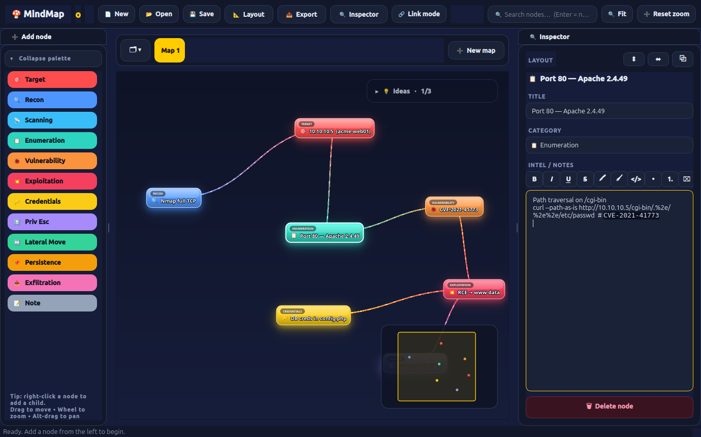

# 🍄 MindMapo

A lively, interactive **mind map for pentest engagements**. Every piece of intel
becomes a glossy, glowing "power-up block" that bounces in, gently floats, and
pops on hover — a Mario-world board for your kill chain.

 



## Features

- **Pentest categories** out of the box — Target, Recon, Scanning, Enumeration,
  Vulnerability, Exploitation, Credentials, Priv Esc, Lateral Movement,
  Persistence, Exfiltration, Notes. Each has its own vivid color, emoji and glow.
- **Multiple maps per asset (tabs).** Keep several mind maps for the same
  engagement side-by-side — e.g. *External*, *Web app*, *AD / internal*. Tabs
  live in a strip above the canvas: **➕ New map** to add, double-click to
  rename, **✕** to close, and click the **🗂 ▾** header to collapse the whole
  strip out of the way. All maps are saved/opened together in one file.
- **Every fact is a node.** Add from the palette, or right-click a node →
  *Add child* to branch your findings.
- **Living canvas** — bouncy spawn, idle float, hover pop, neon glow, and
  connections with a flowing "energy" pulse running between nodes.
- **Inspector panel** — edit a node's title, switch category, and jot intel in a
  full **rich-text editor**: bold / italic / underline / strikethrough, text +
  highlight colors, bullet & numbered lists, and a **code** style with live,
  language-agnostic **syntax highlighting** for pasted commands/snippets.
- **Link mode** — wire any two nodes together; remove links by selecting them,
  right-click → *Remove link*, or a node's *Unlink* submenu.
- **Built for large engagements:**
  - **Search & filter** — toolbar box dims non-matches; `Enter` cycles through hits.
  - **Minimap** — overview navigator (bottom-right); click/drag to jump around.
  - **Collapse subtrees** — right-click → *Collapse subtree* folds descendants into
    a `+N` badge to cut clutter.
  - **Level-of-detail + perf throttle** — zoomed out, nodes simplify and the
    flowing-edge/float animations pause; glow/float auto-disable on huge boards.
- **Layouts** — *Auto-arrange (force)*, *Tree (layered)*, or *Swimlanes (by
  kill-chain phase)* from the **Layout** menu.
- **Export** — board to **PNG**, or a structured **Markdown** report (grouped by
  category, with notes + links) for your deliverable.
- **Idea tracker** — a discreet, faded panel (top-right) for brainstorming things
  to throw at an asset. Collapses to a small `💡 Ideas` pill, tick items off as
  you try them, and it's saved/loaded with the map.
- **Zoom-aware node text** — titles auto-scale with the zoom level so they stay
  legible when you pull back to see the whole board.
- **Smooth zoom & pan** — **right-drag the empty canvas to pan** (like middle-drag),
  fit-to-view, and left-drag for rubber-band multi-select.
- **Save / Open** engagements as plain JSON.

## Install

```bash
pip install -r requirements.txt        # or: pip install PySide6
```

## Run

```bash
python3 main.py      # or ./run.sh
```

The app opens with a small sample engagement so you can see it breathing.

## Controls

| Action | How |
|---|---|
| New map (tab) | **➕ New map** in the tab strip |
| Rename / close map | Double-click a tab / click its **✕** |
| Collapse tab strip | Click the **🗂 ▾** header at the left of the strip |
| Add node | Click a category in the left palette |
| Add child | Right-click a node → **Add child** |
| Edit | Select a node, use the right **Inspector** (or double-click to rename) |
| Move | Drag a node |
| Link two nodes | Toggle **Link mode** (`L`), click source then target |
| Remove a link | Click the connection + `Delete`, or right-click it → **Remove link**, or right-click a node → **Unlink** |
| Change category | Inspector dropdown, or right-click → Category |
| Delete node | Select + `Delete` / `Backspace`, or Inspector button |
| Search | Toolbar search box; `Enter` jumps to next match |
| Collapse subtree | Right-click a node → **Collapse / Expand subtree** |
| Layout | **Layout** menu → Force / Tree / Swimlanes |
| Export | **Export** menu → PNG / Markdown |
| Navigate big maps | Click/drag the **minimap** (bottom-right) |
| Brainstorm ideas | **💡 Ideas** panel (top-right) — click to expand, `↵` to add, tick to check off |
| Format notes | Toolbar above **Intel / Notes** — **B** / *I* / U / S, colors, `</>` code, lists (`Ctrl+B/I/U`) |
| Zoom | Mouse wheel (zoom out far → simplified low-detail mode) |
| Pan | **Right-drag empty canvas**, middle-drag, or **Alt + drag** |
| Multi-select | **Left-drag** a rubber band on empty canvas |
| Fit / reset | `Ctrl+0` / toolbar |
| New / Open / Save | `Ctrl+N` / `Ctrl+O` / `Ctrl+S` |

## Files

| File | Purpose |
|---|---|
| `main.py` | Window, toolbar, sidebar palette, inspector |
| `scene.py` | Canvas model + behaviour (`MindScene`) and view (`MindView`) |
| `node.py` | Animated `MindNode` block (LOD, collapse badge) |
| `edge.py` | Curved, color-blended `Edge` with flowing pulse |
| `minimap.py` | Floating overview navigator |
| `rich_notes.py` | Rich-text Intel/Notes editor + code syntax highlighter |
| `idea_tracker.py` | Discreet, collapsible brainstorm pad |
| `categories.py` | Pentest categories + theme colors |
